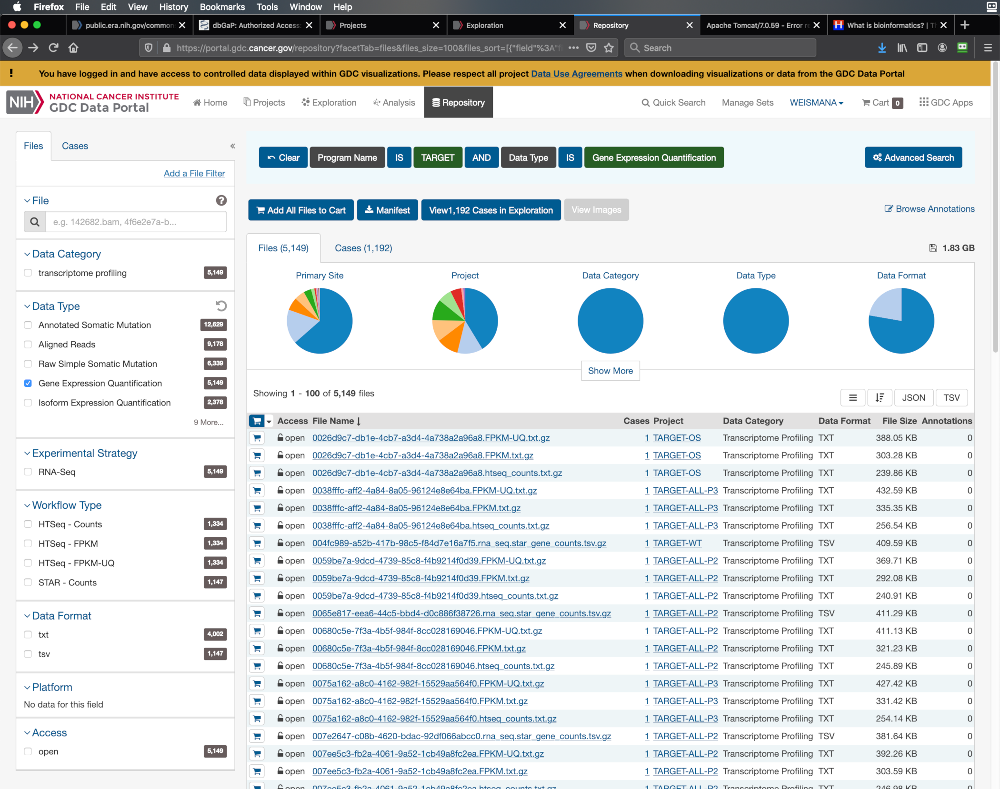

# TARGET classification workflow (using the GDC Data Portal)

Set up the directory structure:

```bash
project_dir="/data/BIDS-HPC/private/projects/dmi2"
working_dir="/home/weismanal/notebook/2020-06-10/dmi"
mkdir "$project_dir" "$working_dir"
cd "$working_dir"
git clone git@github.com:andrew-weisman/target_classification.git "$project_dir/checkout"
mkdir "$project_dir/data"
```

Note: The effort using the data directly from the [TARGET data website](https://target-data.nci.nih.gov) (as opposed to the GDC Data Portal) is in the `target_data_website` branch of this repository.

Download the manifest for [all the gene expression quantification files in the TARGET program](https://portal.gdc.cancer.gov/repository?facetTab=files&files_size=100&files_sort=%5B%7B%22field%22%3A%22file_name%22%2C%22order%22%3A%22asc%22%7D%5D&filters=%7B%22op%22%3A%22and%22%2C%22content%22%3A%5B%7B%22op%22%3A%22in%22%2C%22content%22%3A%7B%22field%22%3A%22cases.project.program.name%22%2C%22value%22%3A%5B%22TARGET%22%5D%7D%7D%2C%7B%22op%22%3A%22in%22%2C%22content%22%3A%7B%22field%22%3A%22files.data_type%22%2C%22value%22%3A%5B%22Gene%20Expression%20Quantification%22%5D%7D%7D%5D%7D&searchTableTab=files) (click on the blue "Manifest" button):



Place the downloaded manifest file as `$project_dir/checkout/manifests/gdc_manifest.2020-06-10-all_gene_expression_files_in_target.txt`.

In addition, click on the blue "Add All Files to Cart" button, go to the cart (top right of page), click on the two blue buttons "Sample Sheet" and "Metadata", and save the resulting two files to `$project_dir/data`. The two files will be named, e.g., `gdc_sample_sheet.2020-07-02.tsv` and `metadata.cart.2020-07-02.json`.

Note that these 5,149 files correspond to 1,192 cases (people [for sure that's what it means]).

Download the expression files from the manifest on Helix:

```bash
module load gdc-client
mkdir "$project_dir/data/all_gene_expression_files_in_target"
cd !!:1
gdc-client download -m "$project_dir/checkout/manifests/gdc_manifest.2020-06-10-all_gene_expression_files_in_target.txt"
```

Extract the resulting compressed files and link to them from a single folder `$project_dir/data/all_gene_expression_files_in_target/links`:

```bash
mkdir links
cd !!:1
for file in $(find ../ -iname "*.gz"); do gunzip "$file"; done
for file in $(find ../ -type f | grep -v "/logs/\|/annotations.txt"); do ln -s $file; done
ln -s "$project_dir/checkout/manifests/gdc_manifest.2020-06-10-all_gene_expression_files_in_target.txt" MANIFEST.txt
```

Note that

```bash
for file in $(ls | grep -v MANIFEST.txt); do echo $file | awk -v FS="." '{print $1}'; done | sort -u | wc -l
```

shows that, ostensibly, there are 2,481 unique expression files (independent of normalization). This is just based on the filenames, and is not actually correct.

Go through the Python Jupyter notebook `/data/BIDS-HPC/private/projects/dmi2/checkout/main.ipynb`.
